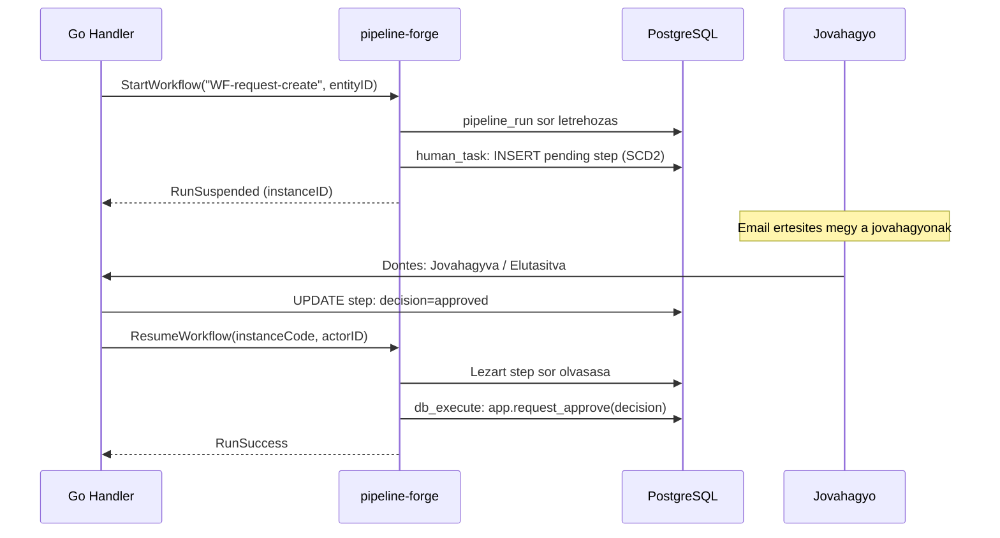

## :package: JiraDa Platform — Fejlesztési módszer {layout=title}
Document = Code · Declarative Logic · Four Engines

**15** repo · **279** pipeline · **50+** adapter · **22** SCD2 tábla

## Három alapillér {layout=cards label="Alapelvek"}

### :file-text: 1. Document = Code {accent=blue}
**Spec = Futtatható**

- Az `.md` fájl egyszerre emberi spec és motor-input
- Nincs külön dokumentáció — a spec önmagyarázó
- Diff-elhető, review-olható, version-controlled
- Komment a mirértet magyarázza, nem a mit

Artefaktok: `entities/EN-*.md` · `lov/*.md` · `pipelines/*.md`

### :flow-arrow: 2. Logic in Pipelines {accent=mauve}
**Üzleti logika ≠ Go kód**

- Többlépéses folyamatok → `pipelines/*.md`
- Go/Python = motor (engine), nem orchestrátor
- Változás = pipeline szerkesztés, nincs recompile
- Egységes retry, audit, suspend/resume minden folyamatra

Motor: pipeline-forge `bin/pf`

### :database: 3. Data > Hardcode {accent=green}
**Konfiguráció = adat**

- Model neveket, tenant értékeket, label-eket soha ne hardcode-olj
- DB registry / config YAML az igazság forrása
- Capability-based filtering, nem name-based
- DB generálja az időbélyegeket, nem a backend

Identitás értékek: env var / config — soha default

---

> :info: Mielőtt `cmd/<folyamat>/main.go`-t írsz: “Lehetne ez pipeline fájl?”

> :shield: Ha egynél több lépés van → igen, pipeline fájl. Ha LLM-hívást kell orchestrálni → `aichat.AIClient`-en át, soha saját provider HTTP.

> :info: Ötödik motor tervezése (saját workflow runner, LLM router, parallel pipeline framework)?

> :shield: Állj meg! A platform már rendelkezik a négy szükséges motorral. Adj hozzá adaptert vagy bővítsd a spec formátumot.

## entity-forge vs pipeline-forge — mikor melyiket? {layout=free label="Motor összehasonlítás" diagrams=first}

```mermaid
flowchart LR
    EN["entities/EN-*.md\nlov/lov_*.md"] --> EF
    PM["pipelines/*.md\ndeklaratív lépések"] --> PF

    EF["entity-forge\nbin/entitygen\ncodegen — one-shot"]
    PF["pipeline-forge\nbin/pf\nruntime engine"]

    EF -.->|"pfbridge\nentity_generate adapter"| PF

    EF --> SQL["SQL DDL\n+ CRUD functions"]
    EF --> GOH["Go handlers\n+ HTMX templates"]
    EF --> BIQ["BI queries\n+ WF scaffolds"]

    PF --> DBO["DB stored\nfunction calls"]
    PF --> LLMO["LLM dispatch\naichat"]
    PF --> HTTPO["HTTP / SMTP\n+ workflow steps"]

    SQL --> PG[("PostgreSQL\nSCD2 + RLS")]
    GOH --> APP["Go App\nvalueForge"]
    DBO --> PG

    classDef blue fill:var(--surface0),stroke:var(--blue),color:var(--text)
    classDef mauve fill:var(--surface0),stroke:var(--mauve),color:var(--text)
    classDef teal fill:var(--surface0),stroke:var(--teal),color:var(--text)
    classDef green fill:var(--surface0),stroke:var(--green),color:var(--text)
    class EF blue
    class PF mauve
    class PG teal
    class APP green
```

### :gear: entity-forge — mikor? {accent=blue}
- Új entitás, LOV, form, BI nézet tervezésekor
- DDL + Go CRUD + HTMX template egyszerre kell
- A spec (`EN-*.md`) generálja az összeset

### :play-circle: pipeline-forge — mikor? {accent=mauve}
- Többlépéses folyamat (ETL, RAG, email, jóváhagyás)
- Változás = pipeline szerkesztés, nincs recompile
- Suspend/resume, retry, audit automatikusan

## entity spec → kész alkalmazás — az egész folyamat {layout=free label="Kód generálás" diagrams=first}

```mermaid
%%{init: {'flowchart': {'fontSize': 18}}}%%
graph LR
    subgraph IN["Specifikáció  (bemenet)"]
        EN["EN-*.md\nentity spec"]
        LV["lov_*.md\nLOV spec"]
    end
    EF["entity-forge\nkód generátor"]
    subgraph GEN["Generált fájlok  (vf/generated)"]
        SQ["SQL DDL\n+ CRUD funkciók"]
        GH["Go handler\n+ HTMX template"]
        CJ["datagrid\nkatalóg JSON"]
        PL["pipeline\n*.md"]
    end
    PF["pipeline-forge\nfuttatja a pipeline-t"]
    subgraph OUT["Futó rendszer  (kimenet)"]
        PG[("PostgreSQL\n+ migrációk")]
        APP["valueForge app\nhandlerek + UI"]
    end
    EN --> EF
    LV --> EF
    EF --> SQ & GH & CJ & PL
    EF -.->|"pfbridge"| PF
    PL --> PF
    SQ --> PG
    GH --> APP
    CJ --> APP
    PF --> APP
    classDef blue fill:var(--surface0),stroke:var(--blue),color:var(--text)
    classDef mauve fill:var(--surface0),stroke:var(--mauve),color:var(--text)
    classDef teal fill:var(--surface0),stroke:var(--teal),color:var(--text)
    classDef green fill:var(--surface0),stroke:var(--green),color:var(--text)
    class EF blue
    class PF mauve
    class PG teal
    class APP green
```

### :file-text: Bemenet: spec fájl {accent=blue}
- 1 db `EN-*.md` — tábla, mezők, CRUD, form, AI kontextus
- Emberi olvasásra szánt, ez a forrás az igazsághoz
- LOV spec: szótár táblák, enum értékek

### :gear: Motor: entity-forge + pipeline-forge {accent=mauve}
- Parancs: `SKIP_DIRTY_CHECK=1 bash scripts/build.sh`
- entity-forge: SQL, Go, HTML, JSON egyszerre
- pipeline-forge: pipeline lépések végrehajtása (pfbridge)

### :rocket-launch: Kimenet: kész alkalmazás {accent=green}
- PostgreSQL: DDL migrációk + stored functions
- valueForge app: handler, template, datagrid
- **Generált fájlokat soha ne szerkeszd kézzel!**

## RAG pipeline — dokumentumokból AI tudás {layout=free label="Tudásbázis" diagrams=first}

```mermaid
%%{init: {'flowchart': {'fontSize': 18}}}%%
graph LR
    subgraph SRC["Forrás dokumentumok"]
        CF["Confluence\noldalak"]
        JI["JIRA\nticketek"]
        UR["URL / egyéb\nforrások"]
    end
    subgraph ENG["Motorok"]
        MF["mcp-forge\nRAG builder"]
        PF["pipeline-forge"]
        OL["Ollama\nembedding — gpu01"]
    end
    RD[("rag3_db\npgvector")]
    subgraph MCPS["MCP szerverek"]
        AK["admin-knowledge\n59 MCP tool"]
        IT["iier-tudastar\nIIER tenant"]
    end
    CF & JI & UR --> MF
    MF --> PF
    PF --> OL
    OL --> RD
    RD --> AK & IT
    classDef mauve fill:var(--surface0),stroke:var(--mauve),color:var(--text)
    classDef teal fill:var(--surface0),stroke:var(--teal),color:var(--text)
    classDef green fill:var(--surface0),stroke:var(--green),color:var(--text)
    class MF,PF mauve
    class RD teal
    class AK,IT green
```

### :books: Forrás: vállalati tudás {accent=blue}
- Confluence: specifikációk, döntések, leírások
- JIRA: ticketek, kommentek, státuszok
- URL: külső dokumentumok, API leírások

### :cpu: Motor: mcp-forge + pipeline-forge {accent=mauve}
- mcp-forge: forrás konfig + RAG pipeline szervez
- pipeline-forge: fetch → chunk → embed lépések
- Ollama: szöveg → vektor (snowflake-arctic-embed2)

### :brain: Kimenet: AI tudásbázis {accent=green}
- rag3_db: pgvector — szemantikus keresés
- admin-knowledge: 59 MCP tool, Confluence + DWH
- iier-tudastar: IIER tenant RLS-iz olált pilot

## AI chat futás — kérdéstől a válaszig {layout=free label="AI chat" diagrams=first}

```mermaid
%%{init: {'flowchart': {'fontSize': 18}}}%%
graph LR
    USR(["Felhasználó"])
    subgraph JO["johanna  —  SSO + WebSocket"]
        AUTH["autentikáció\nmulti-corporate SSO"]
        ORCH["aichat pipeline\norchestrátor"]
    end
    subgraph KNOW["Tudáslekérdezés"]
        MCP["admin-knowledge MCP\nRAG szemantikus keresés"]
        SQL["NL → SQL\njiramntr DWH lekérdezés"]
    end
    subgraph LLM["LLM motorok"]
        OLM["Ollama\nlokális — gpu01"]
        GMN["Gemini / Claude\nfelhő API"]
    end
    USR -->|"kérdés"| AUTH
    AUTH --> ORCH
    ORCH --> MCP & SQL
    MCP & SQL --> LLM
    LLM -->|"válasz"| USR
    classDef blue fill:var(--surface0),stroke:var(--blue),color:var(--text)
    classDef mauve fill:var(--surface0),stroke:var(--mauve),color:var(--text)
    classDef teal fill:var(--surface0),stroke:var(--teal),color:var(--text)
    classDef green fill:var(--surface0),stroke:var(--green),color:var(--text)
    class AUTH,ORCH blue
    class MCP green
    class SQL teal
    class OLM,GMN mauve
```

### :chat-circle-dots: johanna — belépési pont {accent=blue}
- SSO autentikáció — multi-corporate
- WebSocket: valós idejű chat felület
- Persona-alapú személyre szabás

### :magnifying-glass: Tudáslekérdezés {accent=green}
- admin-knowledge: RAG szemantikus keresés rag3_db-ből
- NL → SQL: természetes nyelvű DWH lekérdezés
- Kontextus összeállítás az LLM számára

### :robot: LLM — válasz generálás {accent=mauve}
- Ollama: helyi GPU (gpu01) — adatvédelem
- Gemini / Claude: felhő API — teljesítmény
- aichat diszpécser: modell + tenant alapján választ

## entity-forge — Mi mit generál? {layout=split ratio=40-60 label="entity-forge"}

### Input: Entity spec {accent=blue}
`entities/EN-018_dokumentum_tipus.md`

- **HEADER** — metaadat (schema, SCD2, RLS…)
- **COLUMNS** — mezők, típusok, LOV hivatkozások
- **RELATIONSHIPS** — FK és back-referenciák
- **CRUD** — generálandó műveletek listája
- **FORMS** — create / edit / view variánsok
- **AI_CONTEXT** — AI számára teljes kontextus

#### Generálás parancs

```bash
SKIP_DIRTY_CHECK=1 \
  bash scripts/build.sh

# Eredmeny:
# OK  EN-018_dokumentum_tipus.md
#     -> 9 file(s)
```

> :warning: Generált fájlokat soha ne szerkeszd!

### {accent=mauve}
| Generált fájl | Tartalom |
|---|---|
| `database/generated/EN-018_*.sql` | DDL + CRUD stored functions: list, get, insert, update, expire |
| `internal/catalog/dokumentum_tipus.json` | Datagrid column catalog — oszlopok, típusok, rendezés |
| `ui/pages/dokumentum_tipus_list.html` | Lista oldal HTMX template |
| `ui/partials/*_rows.html` | Datagrid sorok HTMX fragment |
| `ui/partials/*_form_create.html` | Create/edit form HTMX fragment |
| `internal/handlers/*_gen.go` | Go handler — list, form, save, expire |
| `bi/queries/app/dokumentum_tipus.md` | GoBI BI lekérdezés fájl (mks_sql_parser) |
| `pipelines/WF-dokumentum_tipus-*.md` | Workflow scaffold — create / update / expire |
| `resources/entity_{en,hu}.json` | i18n label kulcsok |

> :info: Mező változtatás, LOV hozzáadás, form variáns módosítás?

> :shield: Szerkeszd az `entities/EN-*.md` spec-et, futtasd újra a `build.sh`-t. Ne nyúlj a generált fájlokhoz.

## Entity spec formátum — Annotált minimális példa {layout=split label="entity-forge"}

### {accent=sapphire}
```yaml
entity: EN-001
name: kategoria
schema: app
table: app.kategoria
type: Torzsadat
sensitivity: Alacsony
# ^ Alacsony -> RLS nem kotelezo
scd2: false
# ^ false -> mutable tabla, nincs temporal lanc
rls: false
business_key: kod
```

#### COLUMNS

```yaml
- name: kod
  type: text
  required: true
  business_key: true
  labels: { en: "Code", hu: "Kod" }

- name: nev
  type: text
  required: true
  list:
    sort: true
  labels: { en: "Name", hu: "Megnevezes" }

- name: leiras
  type: text
  display:
    list_visible: false
  labels: { en: "Description", hu: "Leiras" }
```

#### FORMS

```yaml
create:
  fields: [kod, nev, leiras]
edit:
  inherit: create
view:
  inherit: edit
  readonly_roles: [all]
```

#### CRUD

```yaml
generate: [list, get, insert, update, expire]
list:
  search_fields: [kod, nev]
  default_sort: { field: nev, dir: asc }
  page_sizes: [25, 50]
```

### HEADER kulcsmezők {accent=blue}
| Mező | Hatás |
|---|---|
| `scd2: true` | Generál `valid_period tstzrange`, `is_current`, audit mezőket, btree_gist constraint-et |
| `rls: true` | Automatikus `ENABLE ROW LEVEL SECURITY` + policy generálás |
| `sensitivity` | Alacsony / Közepes / Magas — Közepes felett RLS kötelező |
| `tenant_partitioned` | Multi-tenant izolálás tábla szinten |

#### Mező típusok

`text` `integer` `numeric` `boolean` `date` `timestamptz` `uuid` `enum (LOV)` `jsonb` `text[]`

#### SCD2 + RLS bekapcsolva

```yaml
sensitivity: Kozepes
# ^ -> RLS kotelezo
scd2: true
# ^ -> valid_period tstzrange,
#   is_current GENERATED ALWAYS AS
#   (upper_inf(valid_period)) STORED,
#   btree_gist EXCLUDE USING gist
rls: true
# ^ -> meta.has_tenant_access policy
```

## Generálás folyamata — Entity spec → Production kód {layout=free label="entity-forge" diagrams=first}

```mermaid
flowchart LR
    SPEC["entities/\nEN-018_*.md"] --> PARSER["entity-forge\nparser + generator\n(Go)"]
    PARSER --> SQL["database/generated/\n*.sql\n(DDL + CRUD fn-ek)"]
    PARSER --> CAT["internal/catalog/\n*.json\n(datagrid config)"]
    PARSER --> HDL["internal/handlers/\n*_gen.go\n(Go handler)"]
    PARSER --> UI["ui/pages/ + partials/\n*.html\n(HTMX template)"]
    PARSER --> BI["bi/queries/app/\n*.md\n(GoBI lekerdezs)"]
    PARSER --> WF["pipelines/\nWF-*-create/update/expire.md\n(workflow scaffold)"]
    PARSER --> I18N["resources/\nentity_{en,hu}.json\n(i18n)"]
    SQL -->|"migrate up"| DB[("PostgreSQL\napp schema")]
    CAT --> DG["datagrid\nlibrary"]
    HDL -->|"go build"| BIN["server binary"]
    UI  -->|"go:embed"| BIN
    BI  --> GOBI["GoBI engine"]
    classDef blue fill:var(--surface0),stroke:var(--blue),color:var(--text)
    classDef mauve fill:var(--surface0),stroke:var(--mauve),color:var(--text)
    classDef teal fill:var(--surface0),stroke:var(--teal),color:var(--text)
    class SPEC blue
    class PARSER mauve
    class DB teal
```

### 1. Spec szerkesztése {accent=blue}
- Mező hozzáadás/módosítás az `EN-*.md`-ben
- LOV hivatkozás, sensitivity, scd2 flag
- Form variáns, CRUD műveletek

### 2. Generálás + build {accent=mauve}
```bash
SKIP_DIRTY_CHECK=1 \
  bash scripts/build.sh
```

- entitygen parser futása
- `go build ./...` az összes generált fájllal

### 3. Migration {accent=teal}
```bash
migrate \
  -path ./migrations \
  -database $DB_URL up
```

- Idempotens SQL — újrafuttatható
- DDL tervet mutasd meg előbb!

## Pipeline formátum — Valós példa: Napi ETL {layout=split ratio=40-60 label="pipeline-forge"}

### Napi ETL {accent=sapphire}
#### Pipeline

```yaml
name:     "jiramntr_daily_etl"
trigger:  "jiramntr_etl"
schedule: "0 2 * * *"
```

#### Adapters

```yaml
http:
  jiramntr_url: "${JIRAMNTR_URL}"
db:
  dsn: "${PG_DSN}"
llm:
  provider:    "${AI_PROVIDER}"
  temperature: 0.1
smtp:
  host:   "${SMTP_HOST}"
  to_ops: "${ETL_OPS_EMAIL}"
```

#### Step: trigger_etl — http

```yaml
config:
  url:    "${config.adapters.http.jiramntr_url}/scheduler/run"
  method: POST
  body:   "job_key=etl:full"
  output_key: trigger_response
on_error: etl_unreachable
```

#### Step: poll_etl_completion — shell

```yaml
config:
  output_key: etl_final_status
on_error: send_timeout_alert
```

```bash
for i in $(seq 1 180); do
  STATUS=$(psql "${PG_DSN}" -t -A -c \
    "SELECT status FROM meta.etl_log
     WHERE table_name='etl:full'
     ORDER BY start_time DESC LIMIT 1")
  case "$STATUS" in SUCCESS|FAILED|PARTIAL)
    echo "$STATUS"; exit 0;; esac
  sleep 60
done
```

#### Step: summarize_run — llm_generate

```yaml
config:
  provider:      "${config.adapters.llm.provider}"
  system_prompt: "Be concise and factual."
  output_key:    email_body
```

#### Step: send_etl_report — smtp

```yaml
config:
  subject: "[jiramntr] ETL ${etl_final_status}"
  body_key: email_body
```

### Pipeline fájl sémája {accent=mauve}
- `# Title` — H1 első sorban
- `## Pipeline` YAML blokk: `name`, `trigger`, `schedule`
- `## Adapters` blokk: megosztott kapcsolatok
- Lépés: `## Step: <id> — <adapter>`

#### on_error routing

- Névvel hivatkozott lépésre ugrik hibánál
- Külön `etl_unreachable` és `send_timeout_alert` ágak
- Nincs külön exception handler kód

#### Interpoláció

- `${config.adapters.llm.provider}` — adapter config
- `${etl_final_status}` — előző lépés output
- `${PG_DSN}` — környezeti változó

## Adapter könyvtár {layout=split label="pipeline-forge"}

### {accent=teal}
| Csoport | Adapter | Mit csinál |
|---|---|---|
| **DB** | `db_query` | SELECT stored function-ön át |
| | `db_execute` | INSERT/UPDATE stored function-ön át |
| | `postgres` | Raw SQL (admin use only) |
| **HTTP** | `http` | Általános HTTP hívás |
| | `jira` | JIRA REST API (issues, transitions) |
| | `confluence` | Confluence REST + page fetch |
| **AI** | `llm_generate` | LLM szöveg generálás |
| | `embed_query` | Ollama embedding |
| | `rerank` | Cross-encoder reranking |
| **RAG** | `rag_search` | pgvector HNSW keresés |
| | `rag_compact_search` | Tömörített RAG output |
| | `output` | Pipeline eredmény formázás |
| **Control** | `human_task` | Emberi jóváhagyás (suspend/resume) |
| | `rule_engine` | SZ-xx üzleti szabály futtatás |
| | `log` | Strukturált GELF log |
| **IO** | `smtp` | Email küldés |
| | `shell` | Shell script futtatás |

### Teljes adapter regisztrálása — 6 hely {accent=mauve}
1. `adapter/<type>/<type>.go` — Adapter interface
2. `cmd/pf/main.go` — `reg.Register(...)`
3. `cmd/pf-ui/server.go` NewServer() — Register
4. `cmd/pf-ui/server.go` builtinStepTypes
5. `cmd/pf-ui/ui/dag.css` — `.node--<type>`
6. `docs/adapters/<group>.md` — dokumentáció

#### Step interpoláció

```text
{{ $payload.tenant }}
# ^ input payload mezo

{{ $node["Step Id"].json.field }}
# ^ elozo step output erteke

${config.adapters.db.dsn}
# ^ adapter konfig referencia

${ETL_OPS_EMAIL}   # env var
${TODAY}           # beepitett valtozo
```

## Workflow pipeline-ok — Suspend / Resume emberi jóváhagyással {layout=free label="pipeline-forge" diagrams=first}



### Step: Manager Approval — human_task {accent=mauve}
```yaml
config:
  name:        "Vezető jóváhagyás"
  assignee_id: "{{ $payload.manager_id }}"
  due_hours:   48
```

```text
# Első futás:
#   INSERT pending sor (SCD2), suspend.
# Resume (jóváhagyás után):
#   lezárt sor olvasása és folytatás.
```

### Go Workflow API {accent=blue}
```go
// Inditas
res, err := pipelines.StartWorkflow(
  ctx, tenant, code, "WF-name",
  entityType, entityID, actorID,
  map[string]any{"key": val})
// res.Status == RunSuspended

// Folytas (jovahagyas utan)
res, err = pipelines.ResumeWorkflow(
  ctx, tenant, code, actorID,
  map[string]any{"lang": "hu"})
```

### valueForge pipeline-ok {accent=green}
- 27 FY (folyamat) pipeline
- 39 INT (integráció) pipeline
- 211 WF (workflow scaffold, entitygen)
- 20 RULE-SZ (üzleti szabályok)

### Megfigyelhetőség {accent=teal}
- Minden futás → `meta.pipeline_run` sor
- GELF strukturált logging stdout-ra
- `bin/pf --dry-run pipeline.md`
- `on_error: named_step` fallback routing

### Trigger típusok {accent=yellow}
- `manual` — kézi / API indítás
- `cron` — ütemezett (cron kifejezés)
- `event` — esemény-vezérelt
- `workflow` — hosszan futó suspend/resume

## GoBI — BI lekérdezések és mks_sql_parser dinamikus SQL {layout=split label="GoBI"}

### Document types {accent=sapphire}
#### Report

```yaml
icon: "ph ph-chart-bar"
title:
  en: "Document types"
  hu: "Dokumentumtipusok"
```

#### Parameters

```yaml
- name: status
  type: TEXT
  input: "lov:SELECT kod AS value,
    app.lov_label(nev, :current_lang)
    AS label FROM app.lov_aktiv_statusz
    WHERE aktiv ORDER BY sort_order"
  labels: {en: Status, hu: Statusz}
```

#### SQL

```sql
SELECT dt.dokumentum_tipus_code,
       dt.tipusnev,
       app.lov_label(dt.aktiv_statusz,
         :current_lang) AS statusz
  FROM app.dokumentum_tipus dt
 WHERE dt.tenant_code = :tenant
--<status
   AND dt.aktiv_statusz = :status
-->
   AND dt.is_current
 ORDER BY dt.tipusnev
```

#### COLUMNS

```yaml
- column: dokumentum_tipus_code
  labels: {en: Code, hu: Kod}
- column: statusz
  labels: {en: Status, hu: Statusz}
```

### mks_sql_parser — Dinamikus SQL szintaxis {accent=mauve}
```sql
SELECT id, name, status
  FROM app.entity
 WHERE is_current              -- mindig bent
--<admin
   AND role = 'admin'          -- ha {"admin":true}
-->
   AND tenant_code = :tenant   -- :param subst.
   AND status = '%status%'     -- %key% subst.
   AND type = $1->>'type'     -- #'type' (sor ha truthy)
```

| Szintaxis | Hatás |
|---|---|
| `--<KEY … -->` | Block: csak ha KEY truthy a JSON-ban |
| `:key` | Param — sor törlődik ha kulcs hiányzik |
| `%key%` | Érték — üres string ha kulcs hiányzik |
| `… -- #'key'` | Line filter — sor csak ha KEY truthy (érték nem helyettesítődik) |

Példa: `WHERE status = $1->>'status' -- #'status'` — sor csak ha `status` jelen van a JSON-ban

#### mks_parser JSONB operátorok

`->#` numeric · `->^` bigint · `->@` timestamp · `->&` boolean · `->>>` text[] · `->^^` int[] · `===` array eq

Két futtatási mód: PG extension (`SELECT mks_parser($sql, $json)`) és Go `bi.PreprocNative` (CI). Mindkét mód azonos SQL-t kell adjon ugyanarra az inputra.

## JSONB CRUD minta — Minden adat stored function-ön át {layout=cards label="Adatbázis"}

### :x-circle: SOHA — Inline DML Go/Python kódban {accent=red}
```go
// BAD -- kozvetlen DML
pool.Exec(ctx,
  `INSERT INTO app.entity (name, tenant_code)
   VALUES ($1, $2)`, name, tenant)

# BAD -- kozvetlen SELECT
cur.execute("SELECT * FROM dwh.dim_user
  WHERE user_key = %s", (key,))
```

### :check-circle: MINDIG — Stored function hívás {accent=green}
```go
// GOOD -- Go caller
payload, _ := json.Marshal(map[string]any{
    "tenant": tenant, "id": id})
var raw []byte
pool.QueryRow(ctx,
    "SELECT app.entity_get($1::jsonb)",
    string(payload)).Scan(&raw)

# GOOD -- Python caller
cur.execute(
    "SELECT dwh.user_get_key(%s)", (name,))
```

---

#### JSONB function minta (SQL)

```sql
CREATE OR REPLACE FUNCTION app.entity_list(p_data jsonb)
RETURNS jsonb
LANGUAGE sql STABLE SECURITY DEFINER
SET search_path = pg_catalog, app, meta AS $fn$
    SELECT jsonb_build_object(
        'rows',  jsonb_agg(row_to_json(r)),
        'total', COUNT(*) OVER ()
    )
    FROM (
        SELECT col1, col2, col3
          FROM app.entity
         WHERE tenant_code = p_data->>'tenant'
           AND is_current
         ORDER BY col1
         LIMIT  COALESCE((p_data->>'limit')::int, 25)
         OFFSET COALESCE((p_data->>'offset')::int, 0)
    ) r;
$fn$;
```

#### Miért JSONB?

- Mező hozzáadás = csak JSON payload változik
- Nincs function signature change
- Nincs Go/Python caller change
- Nincs pipeline step change

#### Időbélyegek — DB generálja

```sql
-- GOOD: DB clock
INSERT INTO app.entity (name, created_at)
VALUES ($1, now());

-- BAD: backend clock -- soha ne adj
-- time.Now() / datetime.now() parametert!
```

## SCD2 — Temporal Versioning & Row Level Security {layout=split label="Adatbázis"}

### SCD2 táblaszerkezet (generált DDL) {accent=teal}
```sql
CREATE TABLE app.dokumentum_tipus (
  id          uuid NOT NULL DEFAULT gen_random_uuid(),
  tenant_code text NOT NULL,
  -- business columns:
  dokumentum_tipus_code text NOT NULL,
  tipusnev              text,
  -- SCD2 audit cols (entity-forge generalja):
  valid_period tstzrange NOT NULL
                DEFAULT tstzrange(now(), NULL),
  is_current   boolean GENERATED ALWAYS AS
                (upper_inf(valid_period)) STORED,
  created_at   timestamptz NOT NULL DEFAULT now(),
  updated_at   timestamptz NOT NULL DEFAULT now(),
  PRIMARY KEY (tenant_code, id, valid_period),
  -- Egy tenant_code+id par nem fedhet at
  -- valid_period szerint (btree_gist kell):
  EXCLUDE USING gist (
    tenant_code WITH =, id WITH =, valid_period WITH &&)
);
```

### SCD2 olvasás és mutáció {accent=yellow}
```sql
-- Aktualis rekordok (ket egyenerteeku mod):
WHERE upper_inf(valid_period)  -- pontos
WHERE is_current               -- kényelmes

-- Historikus lekerdezés:
WHERE valid_period @>
  '2026-01-15'::timestamptz
```

> :warning: Soha ne adj raw UPDATE-et SCD2 táblákon! Mindig CRUD function-ön át. 22 leaf partíció van `btree_gist &&` constraint-tel.

#### RLS Policy (generált)

```sql
ALTER TABLE app.dokumentum_tipus
  ENABLE ROW LEVEL SECURITY;

CREATE POLICY p_read
  ON app.dokumentum_tipus FOR SELECT
  USING (meta.has_tenant_access(tenant_code));

CREATE POLICY p_write
  ON app.dokumentum_tipus FOR INSERT
  WITH CHECK (
    meta.can_write_tenant(tenant_code));
```

---

| 22 — SCD2 leaf partíció | sensitivity | rule |
|---|---|---|
| valueForge | Alacsony → RLS opcionális | `ENABLE RLS` + policy együtt mindig |
| `btree_gist &&` constraint | Közepes → RLS kötelező | App nem re-számolja a tenant filtert |
| | Magas → RLS + auditlog | SECURITY DEFINER + `search_path` |

## RAG archítektúra — admin-knowledge 3 rétegű rendszer {layout=free label="RAG" diagrams=first}

```mermaid
graph TB
    subgraph T1["1. reteg -- Python MCP Server"]
        MCP["server.py  59 MCP tool\nNev-feloldas, SQLite cache\nLink rendering (_enrich_rows)"]
    end
    subgraph T2["2. reteg -- Pipeline Engine"]
        PF["bin/pf  pipeline-forge"]
        P1["rag/search_rag.md\nembed -> vector -> output"]
        P2["org/user_details.md\ndwh.user_get_key()"]
        P3["inventory/inventory_mutate.md\n3-step audit loop"]
    end
    subgraph T3["3. reteg -- Adatok"]
        RAG[("rag3_db\nsys-gpu01\npgvector HNSW")]
        DWH[("jiramntr_db\nsys-butalam\nSECURITY DEFINER")]
        JIRA["JIRA REST\n(PAT szukseges)"]
    end
    CC["Claude Code\nCLI"] -->|"stdio MCP"| MCP
    MCP -->|"subprocess"| PF
    PF --> P1 & P2 & P3
    P1 -->|"cosine search"| RAG
    P2 -->|"dwh.user_*"| DWH
    P3 -->|"Audit loop"| JIRA
    P3 -->|"audit row"| DWH
    classDef blue fill:var(--surface0),stroke:var(--blue),color:var(--text)
    classDef mauve fill:var(--surface0),stroke:var(--mauve),color:var(--text)
    classDef teal fill:var(--surface0),stroke:var(--teal),color:var(--text)
    classDef green fill:var(--surface0),stroke:var(--green),color:var(--text)
    class MCP mauve
    class PF blue
    class RAG teal
    class DWH green
```

### 6 RAG collection {accent=blue}
| Collection | Méret |
|---|---|
| `jira_admin` | ~27k chunk |
| `confluence` | ~1.8k chunk |
| `web_docs` | WildFly 39 + Keycloak |
| `dwh_users` | per-user dossier |
| `dwh_inventory` | IT/AD eszközök |
| `dwh_issues` | issue metadata + worklog |

### Write: 3-step Audit Loop {accent=teal}
1. Enqueue: INSERT audit sor (`pending`)
2. Call: JIRA REST POST (per-user PAT)
3. Finalize: UPDATE audit sor (HTTP status, key)

### Embedding {accent=peach}
- Ollama `snowflake-arctic-embed2`
- GPU server: sys-gpu01:11434
- pgvector HNSW index
- Reranker: letiltva (NaN bug Ollama)

### Search logic helye {accent=sky}
- Keresési logika: `pipelines/*.md`
- `server.py` = MCP engine, nem search
- `_enrich_rows()`: link rendering Python-ban
- `pf` binary: PF_BIN → bin/pf → PATH

### DWH hozzáférés {accent=green}
- Csak `dwh.*` SECURITY DEFINER function
- Nincs `SELECT` a `dim_*` táblákon
- LDAP tilos — DWH tükrözi az attribútumokat
- `'me'`: `$USER` env var → DWH

## Biztonsági modell — Védelemben mélység (Defense in Depth) {layout=free label="Biztonság" diagrams=first}

```mermaid
%%{init: {'flowchart': {'fontSize': 18}}}%%
graph LR
    subgraph L1["1. Titkositas -- GPG Vault"]
        GPG[".env.gpg (commitalt)\ncsapat vault_pass\nscripts/vault.sh lock/unlock"]
    end
    subgraph L2["2. DB hozzaferes-vezérles"]
        SEC["SECURITY DEFINER\ndwh.user_get_*\ndwh.inventory_*\nEXECUTE jog csak"]
        RLS["Row Level Security\nmeta.has_tenant_access\nmeta.can_write_tenant"]
    end
    subgraph L3["3. Transport + Web"]
        TLS["PostgreSQL\nsslmode=require"]
        HDR["HTTP headers\nX-Frame-Options: DENY\nnosniff, referrer"]
        WS["WebSocket\norigin allowlist"]
    end
    DEV["Fejleszto"] -->|"vault unlock"| GPG
    GPG -->|".env"| APP["Alkalmazas"]
    APP -->|"EXECUTE only"| SEC
    RLS --> SEC
    APP -->|"sslmode=require"| TLS
    classDef yellow fill:var(--surface0),stroke:var(--yellow),color:var(--text)
    classDef green fill:var(--surface0),stroke:var(--green),color:var(--text)
    classDef teal fill:var(--surface0),stroke:var(--teal),color:var(--text)
    class GPG yellow
    class RLS green
    class SEC teal
```

### GPG Vault szabályok {accent=yellow}
- Commitálva: `.env.gpg` (titkosított)
- Gitignore: `.env` — soha ne commitáld
- API kulcsok fejlécben, soha URL-ben
- Log-ban titkot soha — `***` masking

### Input validation szabályok {accent=red}
- SQL injection: soha string concat, `$1` mindig
- Path traversal: `filepath.Clean()` + base ellenőrzés
- Dynamic identifier: `^[a-zA-Z_][a-zA-Z0-9_.]*$`
- YAML: csak `yaml.safe_load()` — soha `yaml.load()`
- AI SQL: timeout ≤ 5s, sor limit ≤ 1000

### SECURITY DEFINER {accent=teal}
- App role: `EXECUTE` jogosultság
- Nincs `SELECT` a `dim_*` táblákon
- Function: `search_path = pg_catalog, schema`
- AI SQL: `default_transaction_read_only=on`

### Tenant izoláció {accent=mauve}
- RLS: `meta.has_tenant_access(tenant_code)`
- App soha ne re-számolja a filtert
- GUC: `SET app.tenant_code = $1` session-ben
- SCD2 btree_gist izoláció

### Web biztonság {accent=blue}
- `X-Frame-Options: DENY`
- `X-Content-Type-Options: nosniff`
- WebSocket: origin allowlist, soha `return true`
- Template: soha `template.HTML` cast untrusted data

## Git workflow · Build · Deploy · Cross-project blast radius {layout=split label="Fejlesztési workflow"}

### Branch naming {accent=blue}
`feature/*` `fix/*` `data/*` `ai/*` `docs/*`

- Nincs közvetlen commit `main`-be
- Issues: `[repo-name]` prefix a GitHub project-ben
- Milestone → negyedéves release

#### Deploy flow

1. **Ellenőrzés** — systemctl status butalam
2. **Build** — go build ./... bináris commit
3. **Push** — git push main branch
4. **Deploy** — deploy_butalam.sh systemctl restart

### Cross-project blast radius {accent=yellow}
- Library szerkesztés előtt: olvasd a `projects.md` Connections-t
- Nyilvános API változás → build összes consumer előbb
- `mks_parser($sql text, $json text)` — soha ne törd
- `go.mod replace` direktívák = azonnal propagál

```bash
# Pre-commit Go
/usr/local/go/bin/go build ./...
/usr/local/go/bin/go vet ./...
/usr/local/go/bin/go test ./...

# Pre-commit Python
ruff check . && black --check .
python -m pytest
```

> :warning: **Ne csináld — Platform szabályok**
>
> - ORM tilos — `pgx/v5 + pgxpool` az új kódba
> - SPA framework tilos — HTMX + vanilla JS
> - Frontend build lépés tilos `lookin`-ba
> - Migration futtatás terv + jóváhagyás nélkül tilos
> - Tenant értékek hardcode-olása Go/JS kódba tilos
> - Közvetlen DML táblákon tilos — function-ön át
